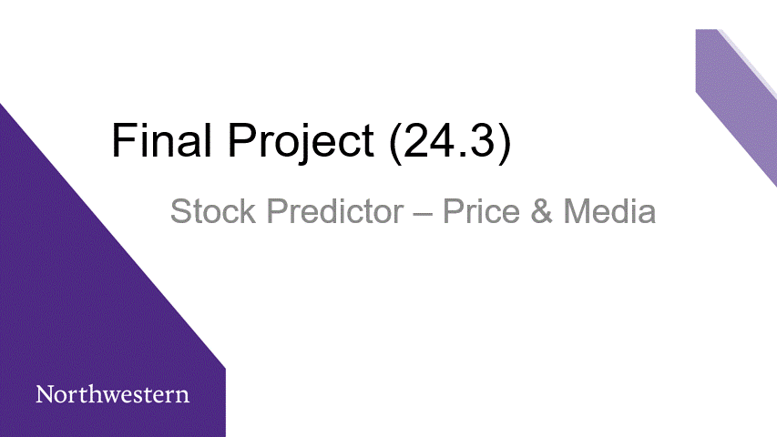

# FinalProject-Stock
 NU-FinalProject 
In this final project our group will attempt to predict future stock prices sourcing data sources from various finance sights. with  pandas and api from reddit and new cycle, out goal is to illustrate the trend of how stocks fluctuate through out time and the factors that affect them.  
### Website
[GitHub Hosted Page](https://ccc-gh.github.io/FinalProject-Stock/)

